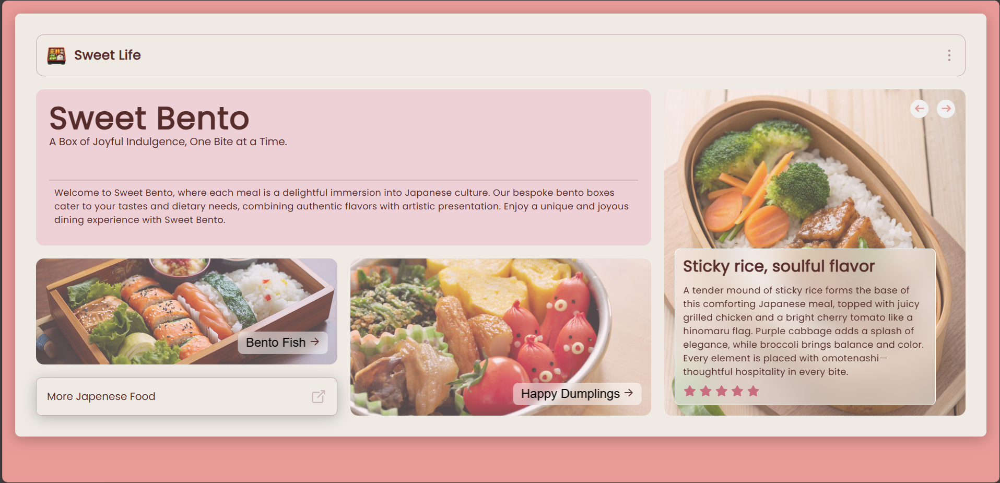
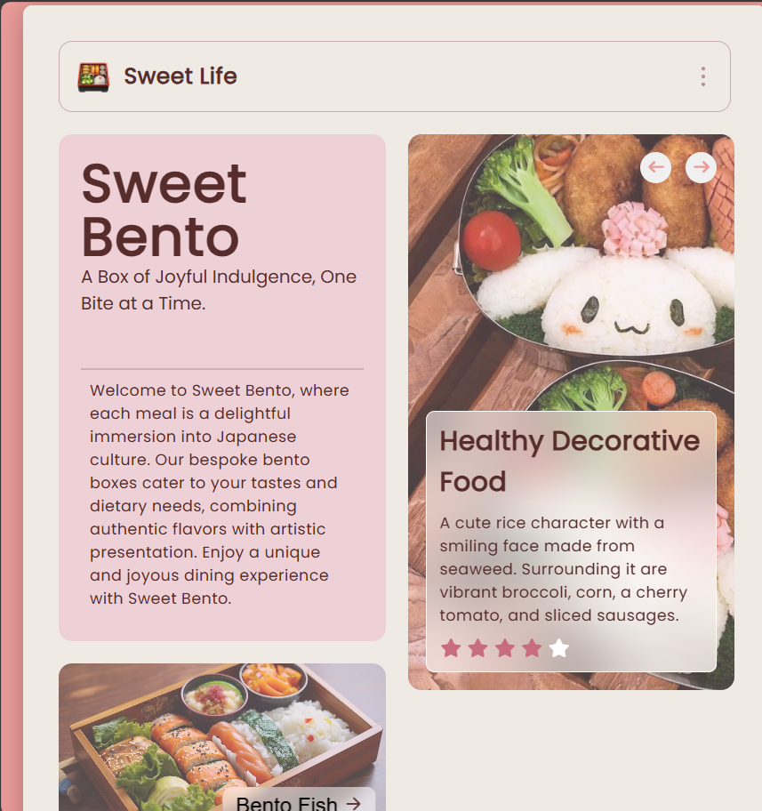
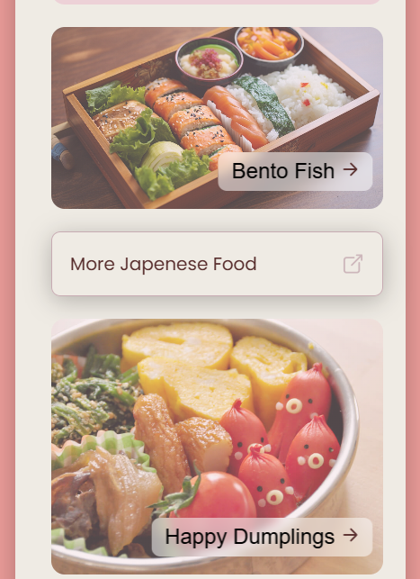

# 🖌️ Project Title

Bento Grid Menu - Eye catchy menu card showing Japenese food in a creative way

# Description 

This sophiticated looking drone page project is a responsive illustration of complex designs into code 

# 🧠 Development Highlights

- 💡 Shape creation purely with CSS — no SVGs or images
- 📄 Static layout built with semantic HTML
- 🎯 Used CSS `gird` property to have a good looking menu card.

  

  ## Demo
  https://bentogridmenu.netlify.app/
  
