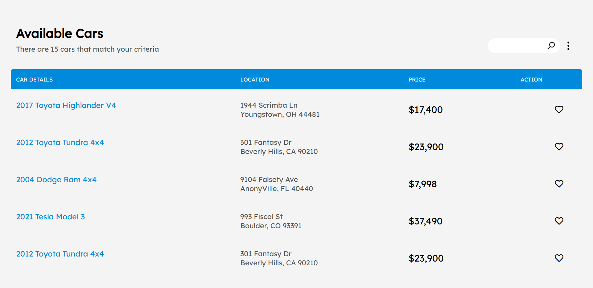
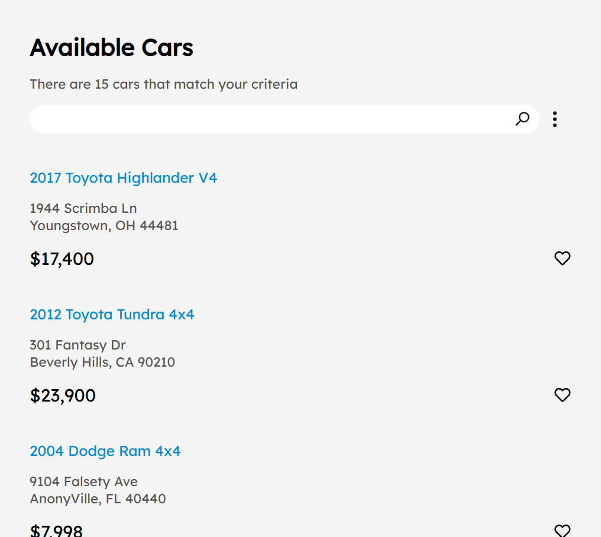

# 🖌️ Project Title

Car sales site – Illustration of clip path property Responsive Project

# Description 

This is a simple project that gives a neat idea where responsive layouts are present and how to use clip path for nice animation can observe it when the  menu icon is clicked

# 🧠 Development Highlights

- 💡 Shape creation purely with CSS — no SVGs or images
- 📄 Static layout built with semantic HTML
-  ✨ Clip-Path Animation
Clicking the menu icon activates a sleek animation using the CSS `clip-path` property.

## Demo
   https://carsalessiteresponsive.netlify.app/

