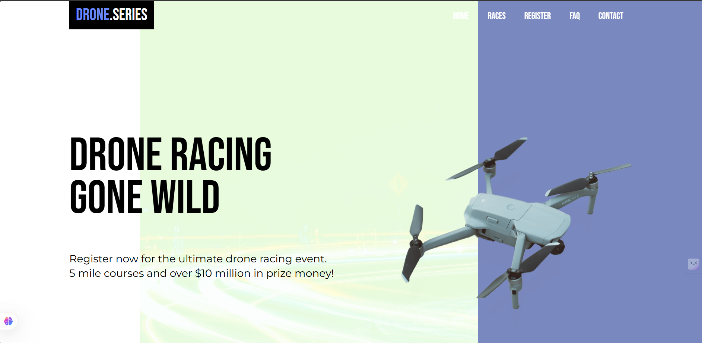
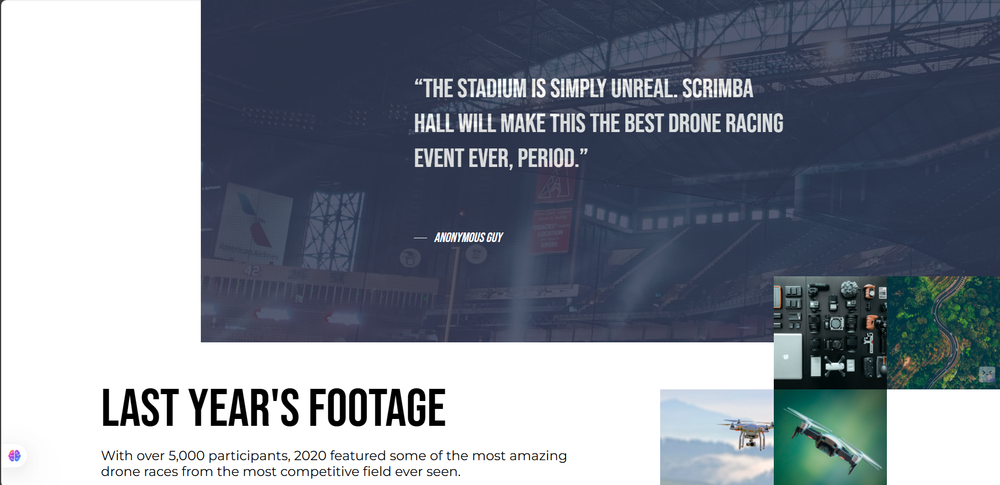

# 🖌️ Project Title

Drone Page – A simple Page that says about drone competition venues

# Description 

This sophiticated looking drone page project is a responsive illustration of complex designs into code 

# 🧠 Development Highlights

- 💡 Shape creation purely with CSS — no SVGs or images
- 📄 Static layout built with semantic HTML
- 🎯 Used CSS `animation` to create smooth, engaging UI transitions.

## Demo

https://dronepageresponsive.netlify.app/

