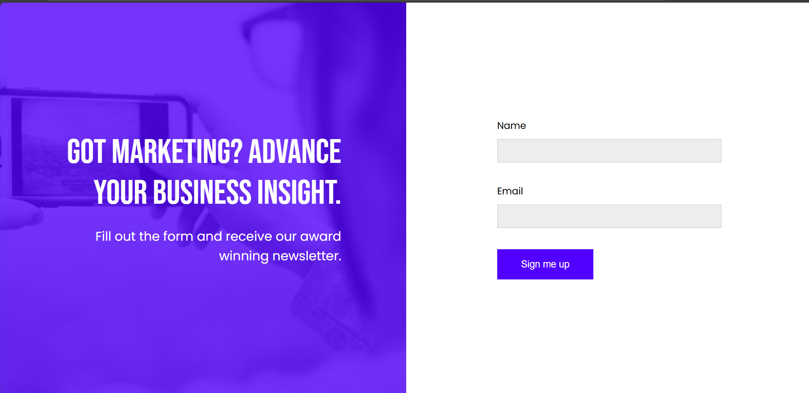
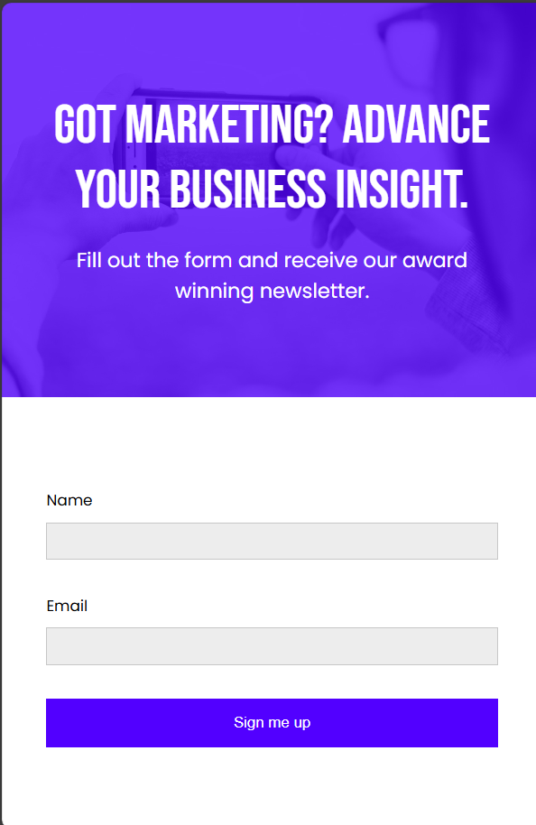
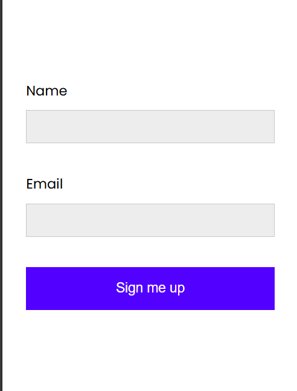

# 🖌️ Project Title

Landing Page – CSS Responsive Project

# Description 

This is a simple project that gives a neat idea where responsive layouts are present how to present background property in css 

# 🧠 Development Highlights

- 💡 Shape creation purely with CSS — no SVGs or images
- 📄 Static layout built with semantic HTML

## Lessons Learned

To build a responsive website with em and rem unit along with a deep dive to background property in css

## Screenshots

 

 

 

 

## Demo
https://landingpageresponsivebusiness.netlify.app/

